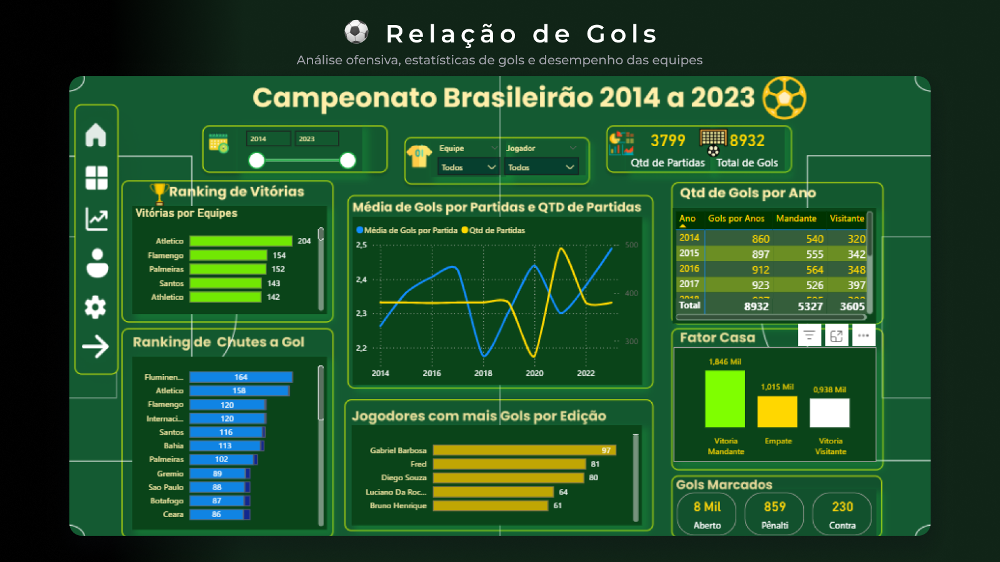
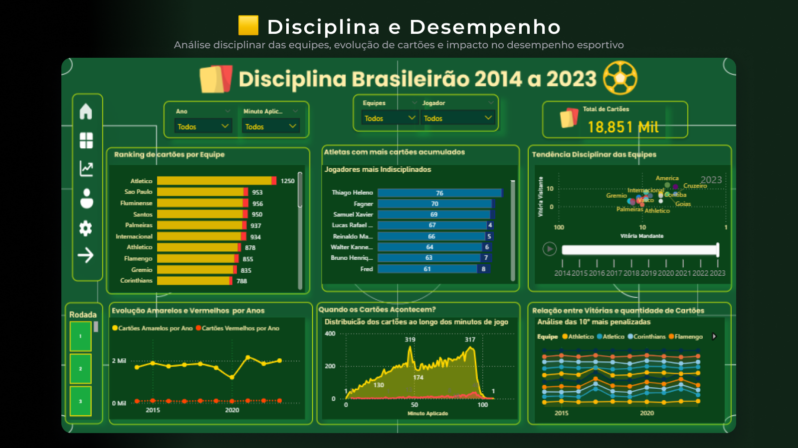
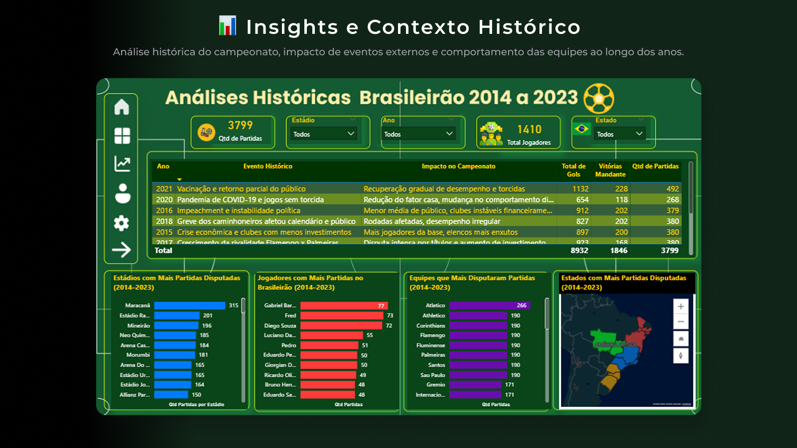
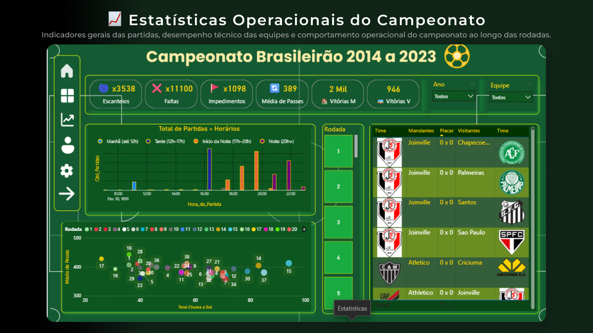
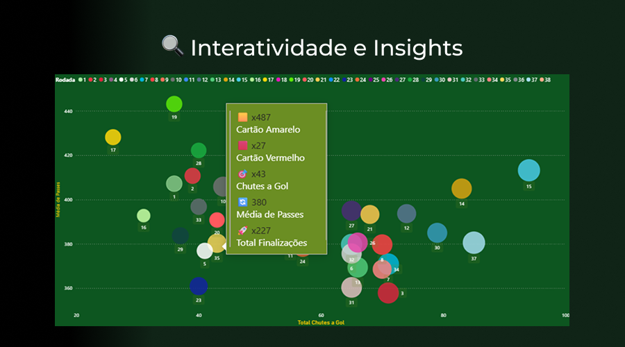

# Análise do Campeonato Brasileiro

Projeto desenvolvido em Power BI com foco em análise de desempenho das equipes do Campeonato Brasileiro.

## Objetivos do Projeto
- Analisar desempenho ofensivo e defensivo
- Avaliar influência do fator casa
- Explorar estatísticas táticas
- Criar dashboards interativos

## Ferramentas Utilizadas
- Power BI
- Excel
- Figma

## Principais Análises
- Ranking de vitórias
- Chutes a gol
- Disciplina das equipes
- Aproveitamento mandante x visitante
- Estatísticas táticas

---
## ⚽ Relação de Gols

Dashboard focado em desempenho ofensivo, estatísticas de gols, ranking de vitórias, fator casa e análise de finalizações das equipes.

---

## 🟨 Disciplina e Desempenho

Análise disciplinar das equipes, evolução de cartões, comportamento por período do dia e impacto da disciplina no desempenho esportivo.

---

## 📊 Insights e Contexto Histórico

Análise histórica do campeonato, impacto de eventos externos e comportamento das equipes ao longo dos anos.

---

## 📈 Estatísticas Operacionais do Campeonato

Indicadores gerais das partidas, desempenho técnico das equipes e comportamento operacional do campeonato ao longo das rodadas.

### 🔍 Interatividade dos gráficos

Os gráficos possuem tooltips personalizados com indicadores complementares para aprofundamento analítico e exploração dinâmica dos dados.

