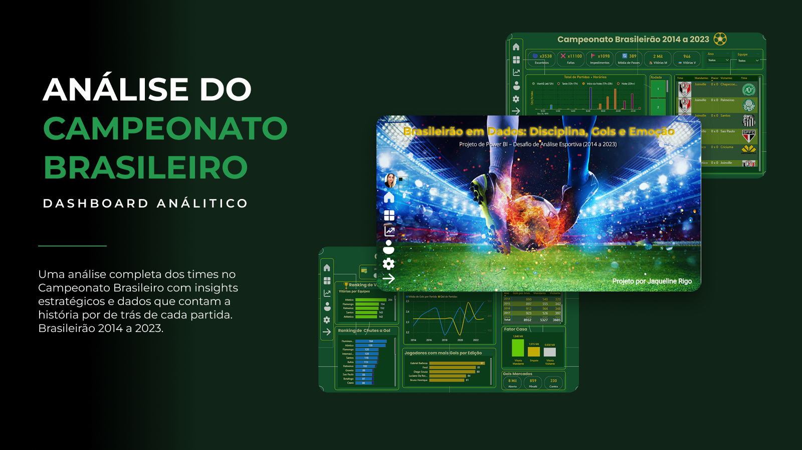

# Análise do Campeonato Brasileiro

Projeto desenvolvido em Power BI com foco em análise de desempenho das equipes do Campeonato Brasileiro.

## Objetivos do Projeto
- Analisar desempenho ofensivo e defensivo
- Avaliar influência do fator casa
- Explorar estatísticas táticas
- Criar dashboards interativos

## Ferramentas Utilizadas
- Power BI
- Excel
- Figma

## Principais Análises
- Ranking de vitórias
- Chutes a gol
- Disciplina das equipes
- Aproveitamento mandante x visitante
- Estatísticas táticas
